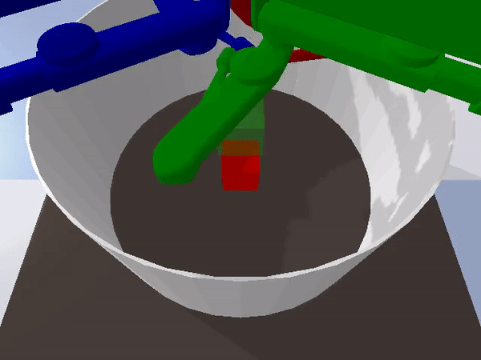
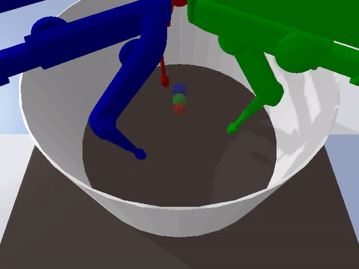
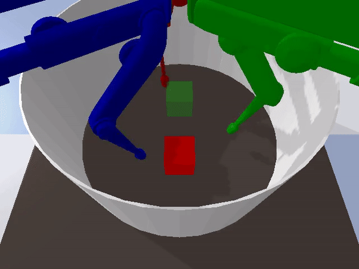
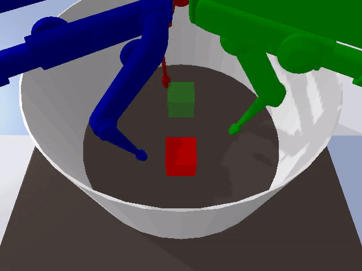
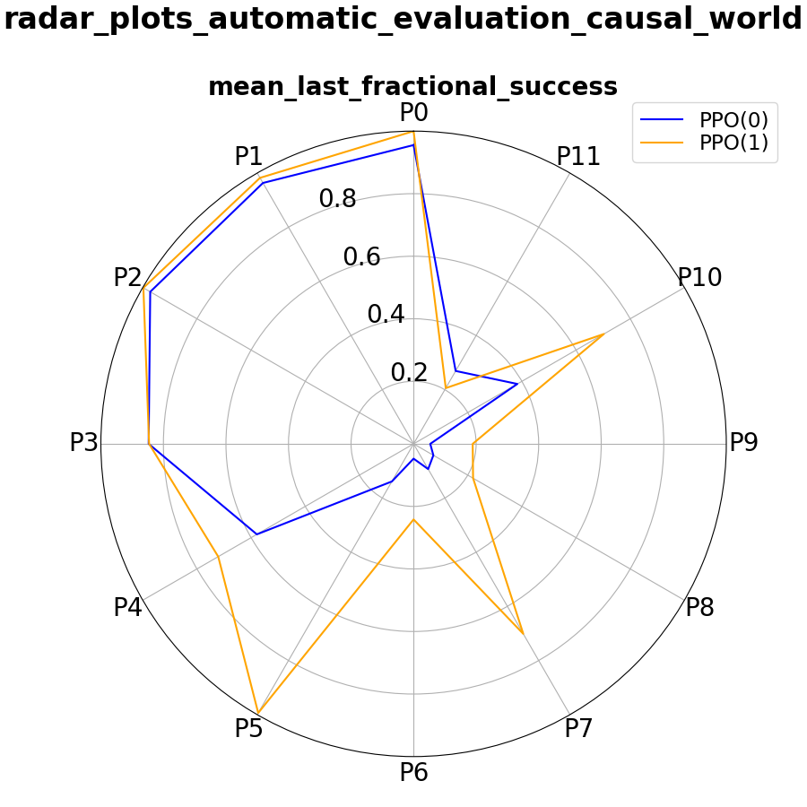
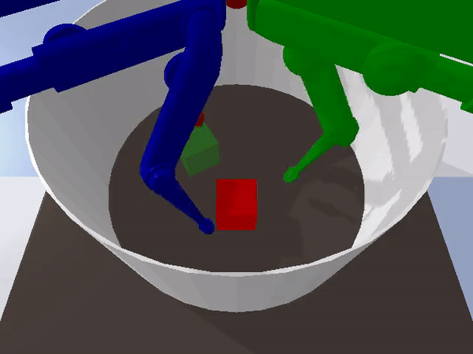
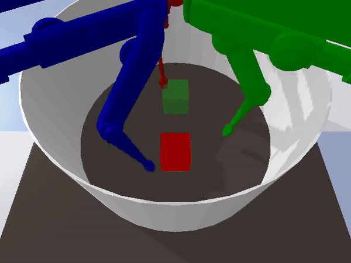
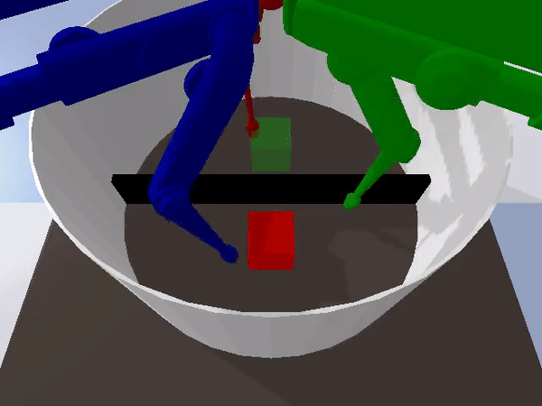

# CausalWorld

[](https://github.com/DAVFoundation/captain-n3m0/blob/master/LICENSE)
[](https://github.com/rr-learning/CausalWorld/releases)
[](https://causal_world.readthedocs.io/en/latest/?badge=latest)
[](https://github.com/rr-learning/CausalWorld/graphs/commit-activity)
[](https://github.com/rr-learning/CausalWorld/pulls)
[](https://github.com/rr-learning)


[](https://circleci.com/gh/rr-learning/CausalWorld)
  
CausalWorld is an open-source simulation framework and benchmark for causal structure and transfer learning in a robotic manipulation environment (powered by bullet) where tasks range from rather simple to extremely hard. Tasks consist of constructing 3D shapes from a given set of blocks - inspired by how children learn to build complex structures. The release v1.0 supports many interesting goal shape families as well as exposing many causal variables in the environment to perform do_interventions on them. Checkout the project's [website](https://sites.google.com/view/causal-world/home) for the baseline results and the paper. 
 
Go [here](https://sites.google.com/view/causal-world/home) for the API documentation.


This package can be [pip-installed](#install-as-a-pip-package-in-a-conda-env-from-source).
<p align=center>

</p>
<p align=center>

</p>

<p align=center>

</p>

**Content:**
- [Announcements](#announcements)
- [Install as a pip package from latest release](#install-as-a-pip-package-from-latest-release)
- [Install as a pip package in a conda env from source](#install-as-a-pip-package-in-a-conda-env-from-source)
- [Why would you use CausalWorld for your research?](#why-would-you-use-causalworld-for-your-research?)
- [Dive In!!](#dive-in!!)
- [Main Features](#main-features)
- [Comparison to other benchmarks](#comparison-to-other-benchmarks)
- [Curriculum Through Interventions](#curriculum-through-interventions)
- [Train Your Agents](#train-your-agents)
- [Test How Your Agent Generalizes](#test-how-your-agent-generalizes)
- [Meta-Learning](#meta-learning)
- [Imitation-Learning](#imitation-learning)
- [Sim2Real](#sim2real)
- [Baselines](#baselines)
- [Citing Causal-World](#citing-causal-world)
- [Contributing](#contributing)

## Announcements

### October 2nd 2020

We release v1.0. Given that its the first release of the framework, we are expecting some issues here and there, so please report any issues you encounter.

## Install as a pip package from latest release

1. Install causal_world

  ```bash
  pip install causal_world
  ```
<details>
<summary>optional steps</summary>
3. Make the docs.

  ```bash
  (causal_world) cd docs
  (causal_world) make html
  ```
4. Run the tests.

  ```bash
  (causal_world) python -m unittest discover tests/causal_world/
  ```
  
5. Install other packages for stable baselines (optional)
```bash
(causal_world) pip install tensorflow==1.14.0
(causal_world) pip install stable-baselines==2.10.0
(causal_world) conda install mpi4py
```
  
6. Install other packages for rlkit (optional)

  ```bash
  (causal_world) cd ..
  (causal_world) git clone https://github.com/vitchyr/rlkit.git
  (causal_world) cd rlkit 
  (causal_world) pip install -e .
  (causal_world) pip install torch==1.2.0
  (causal_world) pip install gtimer
  ```

7. Install other packages for viskit (optional)
  ```bash
  (causal_world) cd ..
  (causal_world) git clone https://github.com/vitchyr/viskit.git
  (causal_world) cd viskit 
  (causal_world) pip install -e .
  (causal_world) python viskit/frontend.py path/to/dir/exp*
  ```
  
8. Install other packages for rlpyt (optional)
 ```bash
  (causal_world) cd ..
  (causal_world) git clone https://github.com/astooke/rlpyt.git
  (causal_world) cd rlpyt 
  (causal_world) pip install -e .
  (causal_world) pip install pyprind
  ```
</details>

## Install as a pip package in a conda env from source

1. Clone this repo and then create it's conda environment to install all dependencies.

  ```bash
  git clone https://github.com/rr-learning/CausalWorld
  cd CausalWorld
  conda env create -f environment.yml OR conda env update --prefix ./env --file environment.yml  --prune
  ```

2. Install the causal_world package inside the (causal_world) conda env.

  ```bash
  conda activate causal_world
  (causal_world) pip install -e .
  ```
<details>
<summary>optional steps</summary>
3. Make the docs.

  ```bash
  (causal_world) cd docs
  (causal_world) make html
  ```
4. Run the tests.

  ```bash
  (causal_world) python -m unittest discover tests/causal_world/
  ```
  
5. Install other packages for stable baselines (optional)
```bash
(causal_world) pip install tensorflow==1.14.0
(causal_world) pip install stable-baselines==2.10.0
(causal_world) conda install mpi4py
```
  
6. Install other packages for rlkit (optional)

  ```bash
  (causal_world) cd ..
  (causal_world) git clone https://github.com/vitchyr/rlkit.git
  (causal_world) cd rlkit 
  (causal_world) pip install -e .
  (causal_world) pip install torch==1.2.0
  (causal_world) pip install gtimer
  ```

7. Install other packages for viskit (optional)
  ```bash
  (causal_world) cd ..
  (causal_world) git clone https://github.com/vitchyr/viskit.git
  (causal_world) cd viskit 
  (causal_world) pip install -e .
  (causal_world) python viskit/frontend.py path/to/dir/exp*
  ```
  
8. Install other packages for rlpyt (optional)
 ```bash
  (causal_world) cd ..
  (causal_world) git clone https://github.com/astooke/rlpyt.git
  (causal_world) cd rlpyt 
  (causal_world) pip install -e .
  (causal_world) pip install pyprind
  ```
</details>


## Why would you use CausalWorld for your research?

The main advantages of this benchmark can be summarized as below:

- That the environment is a simulation of an open-source robotic platform ([TriFinger Robot](https://sites.google.com/view/trifinger/home-page)), hence offering the possibility of sim-to-real transfer.
- It provides a combinatorial family of tasks with a common causal structure and underlying factors (including, e.g., robot and object masses, colors, sizes).
- The user (or the agent) may intervene on all causal variables, which allows for fine-grained control over how similar different tasks (or task distributions) are.
- Easily defining training and evaluation distributions of a desired difficulty level, targeting a specific form of generalization (e.g., only changes in appearance or object mass).
- A modular design to create any learning curriculum through a series of interventions at different points in time.
- Defining curricula by interpolating between an initial and a target task.
- Explicitly evaluating and quantifying generalization across the various axes.
- A modular design offering great flexibility to design interesting new task distribution.
- Investigate the understanding of actions and their effect on the properties of the different objects themselves.
- Lots of tutorials provided for the various features offered.

## Dive In!!

  ```python
from causal_world.envs import CausalWorld
from causal_world.task_generators import generate_task
task = generate_task(task_generator_id='general')
env = CausalWorld(task=task, enable_visualization=True)
for _ in range(10):
    env.reset()
    for _ in range(100):
        obs, reward, done, info = env.step(env.action_space.sample())
env.close()
  ```
 
## Main Features

| **Features**                | **Causal World**              |
| --------------------------- | --------------------------------- |
| Do Interventions            | :heavy_check_mark:                |
| Imitation Learning          | :heavy_check_mark:                |
| Custom environments         | :heavy_check_mark:                | 
| Support HER Style Algorithms| :heavy_check_mark:                |
| Sim2Real                    | :heavy_check_mark:                |
| Meta Learning                  | :heavy_check_mark:                |
| Discrete Action Space                | :heavy_check_mark:                |
| Structure Observations           | :heavy_check_mark:                |
| Visual Observations           | :heavy_check_mark:                |
| Goal Images            | :heavy_check_mark:                |
| Modular interface            | :heavy_check_mark:                |
| Ipython / Notebook friendly | :heavy_check_mark:                |
| Documentation               | :heavy_check_mark:                |
| Tutorials               | :heavy_check_mark:                |

## Comparison to other benchmarks

| **Benchmark**               | **Do Interventions Interface**  | **Procedurally Generated Environments**  | **Online Distribution of Tasks**  | **Setup Custom Curricula**  |**Disentangle Generlaization Ability**  |**Real World Similarity**  |**Open Source Robot**  |**Low Level Motor Control**  |**Long Term Planning**  |**Unified Success Metric**  |
| --------------------------- | ------------------|------------------|------------------|------------------|------------------|------------------|------------------|------------------|------------------|------------------|
| RLBench         | :x:|:x:|:x:|:x:|:x:|:heavy_check_mark:|:x:|:heavy_check_mark:|:x:|:x:|
| MetaWorld         | :x:|:x:|:x:|:x:|:x:|:heavy_check_mark:|:x:|:heavy_check_mark:|:x:|:x:|
| IKEA         | :x:| :x:|:x:|:x:|:x:|:heavy_check_mark:|:x:|:heavy_check_mark:|:heavy_check_mark:|:heavy_check_mark:|
| Mujoban            | :x:|:x:|:x:|:heavy_check_mark:|:x:|:heavy_check_mark:|:x:|:heavy_check_mark:|:heavy_check_mark:|:heavy_check_mark:|
| BabyAI | :x:|:heavy_check_mark:|:x:|:x:|:x:|:x:|:x:|:x:|:heavy_check_mark:|:heavy_check_mark:|
| Coinrun               | :x:|:heavy_check_mark:|:x:|:x:|:x:|:x:|:x:|:x:|:x:|:heavy_check_mark:|
| AtariArcade               | :x:|:x:|:x:|:x:|:x:|:x:|:x:|:x:|:heavy_check_mark:/:x:|:heavy_check_mark:|
| **CausalWorld**              | :heavy_check_mark:|:heavy_check_mark:|:heavy_check_mark:|:heavy_check_mark:|:heavy_check_mark:|:heavy_check_mark:|:heavy_check_mark:|:heavy_check_mark:|:heavy_check_mark:|:heavy_check_mark:|

## Curriculum Through Interventions
To provide a convenient way of specifying learning curricula, we introduce intervention actors.  At each time step, such an actor takes all the exposed variables of the environ-ment as inputs and may intervene on them.  To encourage modularity, one may combine multipleactors in a learning curriculum.  This actor is defined by the episode number to start intervening,the episode number to stop intervening, the timestep within the episode it should intervene and theepisode periodicity of interventions.  
<p align=center>

</p>

```python
from causal_world.task_generators import generate_task
from causal_world.envs import CausalWorld
from causal_world.intervention_actors import GoalInterventionActorPolicy
from causal_world.wrappers.curriculum_wrappers import CurriculumWrapper

task = generate_task(task_generator_id='reaching')
env = CausalWorld(task, skip_frame=10, enable_visualization=True)
env = CurriculumWrapper(env,
                        intervention_actors=[GoalInterventionActorPolicy()],
                        actives=[(0, 1000000000, 1, 0)])

for reset_idx in range(30):
    obs = env.reset()
    for time in range(100):
        desired_action = env.action_space.sample()
        obs, reward, done, info = env.step(action=desired_action)
env.close()
```
## Train Your Agents

<p align=center>

</p>

```python
from causal_world.task_generators import generate_task
from causal_world.envs import CausalWorld
from stable_baselines import PPO2
import tensorflow as tf
from stable_baselines.common.policies import MlpPolicy
from stable_baselines.common.vec_env import SubprocVecEnv


def _make_env(rank):
    def _init():
        task = generate_task(task_generator_id='pushing')
        env = CausalWorld(task=task)
        return env
    return _init

policy_kwargs = dict(act_fun=tf.nn.tanh, net_arch=[256, 128])
env = SubprocVecEnv([_make_env(rank=i) for i in range(10)])
model = PPO2(MlpPolicy,
             env,
             policy_kwargs=policy_kwargs,
             verbose=1)
model.learn(total_timesteps=1000000)
```

## Test How Your Agent Generalizes

<p align=center>

</p>

```python
from causal_world.evaluation import EvaluationPipeline
from causal_world.benchmark import PUSHING_BENCHMARK
import causal_world.evaluation.visualization.visualiser as vis
from stable_baselines import PPO2
task_params = dict()
task_params['task_generator_id'] = 'pushing'
world_params = dict()
world_params['skip_frame'] = 3
evaluation_protocols = PUSHING_BENCHMARK['evaluation_protocols']
evaluator_1 = EvaluationPipeline(evaluation_protocols=evaluation_protocols,
                                 task_params=task_params,
                                 world_params=world_params,
                                 visualize_evaluation=False)
evaluator_2 = EvaluationPipeline(evaluation_protocols=evaluation_protocols,
                                 task_params=task_params,
                                 world_params=world_params,
                                 visualize_evaluation=False)
stable_baselines_policy_path_1 = "./model_pushing_curr0.zip"
stable_baselines_policy_path_2 = "./model_pushing_curr1.zip"
model_1 = PPO2.load(stable_baselines_policy_path_1)
model_2 = PPO2.load(stable_baselines_policy_path_2)

def policy_fn_1(obs):
    return model_1.predict(obs, deterministic=True)[0]

def policy_fn_2(obs):
    return model_2.predict(obs, deterministic=True)[0]
scores_model_1 = evaluator_1.evaluate_policy(policy_fn_1, fraction=0.005)
scores_model_2 = evaluator_2.evaluate_policy(policy_fn_2, fraction=0.005)
experiments = dict()
experiments['PPO(0)'] = scores_model_1
experiments['PPO(1)'] = scores_model_2
vis.generate_visual_analysis('./', experiments=experiments)
```
## Meta-Learning

CausalWorld supports meta lerarning and multi-task learning naturally by allowing do-interventions on a lot of the shared high level variables. 
Further, by splitting the set of parameters into a set A, intended for training and in-distribution evaluation, and a set B, intended for 
out-of-distribution evaluation, we make sure its easy for users to define meaningful distributions of environments for training and evaluation.

We also support online task distributions where task distributions are not known apriori, which is closer to what the robot will face in real life.

## Imitation-Learning

Using the different tools provided in the framework its straight forward to perform imitation learning 
(at least in the form of behavior cloning) by logging the data you want while using your favourite controller.

```python
from causal_world.envs.causalworld import CausalWorld
from causal_world.task_generators import generate_task

from causal_world.loggers.data_recorder import DataRecorder
from causal_world.loggers.data_loader import DataLoader

data_recorder = DataRecorder(output_directory='pushing_episodes',
                             rec_dumb_frequency=11)
task = generate_task(task_generator_id='pushing')
env = CausalWorld(task=task,
                  enable_visualization=True,
                  data_recorder=data_recorder)

for _ in range(23):
    env.reset()
    for _ in range(50):
        env.step(env.action_space.sample())
env.close()

data = DataLoader(episode_directory='pushing_episodes')
episode = data.get_episode(14)
```

## Sim2Real
Once you are ready to transfer your policy to the real world and you 3D printed your own robot in the lab. You can do so easily.

<p align=center>

</p>

```python
from causal_world.envs import CausalWorld
from causal_world.task_generators import generate_task
from causal_world.sim2real_tools import TransferReal


task = generate_task(task_generator_id='reaching')
env = CausalWorld(task=task, enable_visualization=True)
env = TransferReal(env)
for _ in range(20):
    for _ in range(200):
        obs, reward, done, info = env.step(env.action_space.sample())
```

## Baselines
 We establish baselines for some of the available tasks under different learning algorithms, 
 thus verifying the feasibility of these tasks.
 
 The tasks are: **Pushing**, **Picking**, **Pick And Place**, **Stacking2** 
 
<p align=center>

</p>
 
  
## Authors

## Citing Causal-World

## Contributing

A guide coming up soon for how can you contribute to causal_world.

