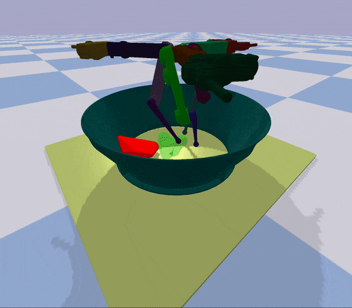
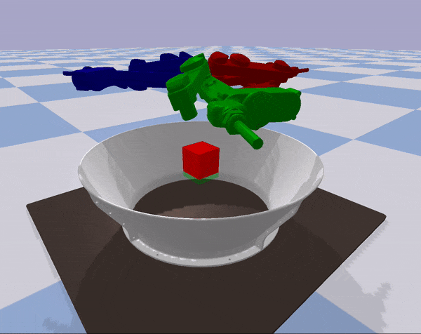

# CausalRLBenchmark {#mainpage}

[TOC]

This package provides the causal rl benchmark. It can be either 
[pip-installed](#install-as-a-pip-package-in-a-conda-env),
or used in a catkin workspace.





## Install as a pip package in a conda env

1. Clone this repo and then create it's conda environment to install all dependencies.

  ```bash
  git clone https://github.com/rr-learning/CausalRLBench
  cd CausalRLBench
  conda env create -f environment.yml OR conda env update --prefix ./env --file environment.yml  --prune
  ```

2. Install the causal_rl_bench package inside the (causal_rl_bench) conda env.

  ```bash
  conda activate causal_rl_bench
  (causal_rl_bench) pip install -e .
  ```

3. Make the docs.

  ```bash
  (causal_rl_bench) cd docs
  (causal_rl_bench) make html
  ```
4. Run the tests.

  ```bash
  (causal_rl_bench) python -m unittest discover tests/causal_rl_bench/
  ```
  
5. Install other packages for rlkit (optional)

  ```bash
  (causal_rl_bench) cd ..
  (causal_rl_bench) git clone https://github.com/vitchyr/rlkit.git
  (causal_rl_bench) cd rlkit 
  (causal_rl_bench) pip install -e .
  (causal_rl_bench) pip install torch==1.2.0
  (causal_rl_bench) pip install gtimer
  ```

6. Install other packages for viskit (optional)
  ```bash
  (causal_rl_bench) cd ..
  (causal_rl_bench) git clone https://github.com/vitchyr/viskit.git
  (causal_rl_bench) cd viskit 
  (causal_rl_bench) pip install -e .
  (causal_rl_bench) python viskit/frontend.py path/to/dir/exp*
  ```
  
7. Install other packages for rlpyt (optional)

## Try out the package

  ```python
    from causal_rl_bench.envs.causalworld import CausalWorld
    from causal_rl_bench.task_generators.task import task_generator
    task = task_generator(task_generator_id='general')
    env = CausalWorld(task=task, enable_visualization=True)
    for _ in range(10):
        env.reset()
        for _ in range(100):
            obs, reward, done, info = env.step(env.action_space.sample())
    env.close()
  ```
  
git clone https://github.com/vitchyr/rlkit.git
cd rlkit 
pip install -e .