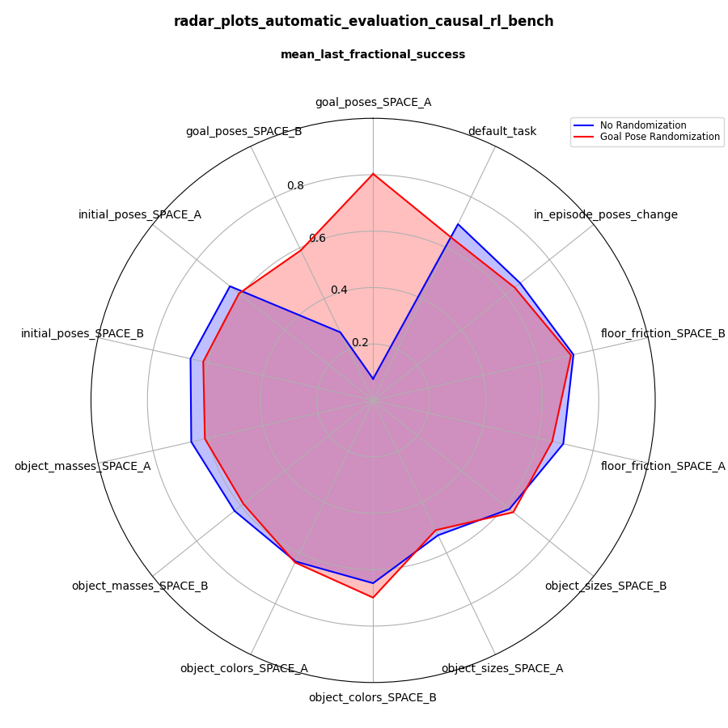

.. _evaluating_policy:

===============
Evaluation Protocols
===============

A central feature of CausalWorld is the explicit parametric formulation of environments
that allow for a precise evaluation of generalisation capabilities with respect to any of the
defining environment variables.

In order to evaluate a certain generalisation aspect a evaluation protocol needs to be defined.
Each evaluation protocol defines a set of episodes that might differ from each other with respect to the
generalisation aspect under consideration. If e.g. the agent is evaluated regarding success under different
masses each episodes is a counterfactual version of the other with the mass of a certain object being the
only difference. It is straight forward to define protocols for other variables such as colors, object sizes,
friction coefficients, different goals, different initial positions or even in-episode interventions aspect to
test robustness aspects. After the given set of environments in a protocol are being evaluated,
various aggregated success metrics are being computed based on the fractional reward profiles of each episode.
For now the following metrics are computes:
1. mean_last_fractional_success (which is the mean of the last fractional reward along all protocol episodes)
2. mean_full_integrated_fractional_success (which is the mean of the normalized average fractional reward along all protocol episodes)
3. mean_last_integrated_fractional_success (which is the mean of the normalized average fractional reward over the last 20 episode time steps along all protocol episodes)

Each of the environments variables has two associated sets of accessible non-overlapping spaces: A and B.
When use_train_space_only is activated for the CausalWorld Object during training all the variables
are only allowed to take values within space A, though they generally wont visit the entire space spanned
(In the extreme case of training on the default task only you will only train on one point in this space).
Training on multiple points of this space can be achieved by the help of a CurriculumWrapper.

Having an explicit split between spaces A and B allows to test generalisation capabilities towards values
that are more in line with the notions of interpolating (space A) and extrapolating (space B) generalisation.

----------------------
Example
----------------------

As an introductory example we want to show you how you can quantify different generalisation aspects depending
on the curriculum exposed during training using the pushing task.
We trained two different agents: First, on the default task only without any type of randomization applied
between episodes. This means the agent always starts with the same initial tool_block pose and the same goal block
pose. Naturally we expect the agent to overfit to this goal over time. Second, we train an agent using a goal
randomization curriculum where we sample new goal poses within space A every two episodes. Still, we keep the
initial tool_block poses and everything else fixed during training. As can be seen from the animation below we
see that the former agent overfits to the single goal pose seen during training whereas the later can also push the
tool block towards other goal poses. Evaluating both agents using the protocols defined in the pushing benchmark
we can quantify and compare performance regarding different aspects in an explicit way. In this case we can see that
the second agent not only generalizes to goal_poses in space A but also to goal_poses in space B, though slightly worse.
Likewise we can see that the agents can generalize to new initial goal poses or in_episode poses interventions to name
just a few interesting observations. Left (no goal pose randomization) and right (goal pose randomization).

.. image:: ../media/pushing_no_randomization.gif
   :scale: 50 %
   :alt: no goal pose randomization
   :align: left

.. image:: ../media/pushing_randomization.gif
   :scale: 50 %
   :alt: goal pose randomization
   :align: left

----------------------
Using default protocols
----------------------

Below we show some demo code how you can systematically evaluate agents on a set
of different protocols and visualize the results in radar plots of different scores

.. literalinclude:: ../../tutorials/evaluating_model/tutorial_one.py
   :language: python

.. literalinclude:: ../../tutorials/evaluating_model/tutorial_two.py
   :language: python

.. literalinclude:: ../../tutorials/evaluating_model/tutorial_three.py
   :language: python

------------------------------
Defining a customized protocol
------------------------------