.. _task_setups:

==================
Task distributions
==================

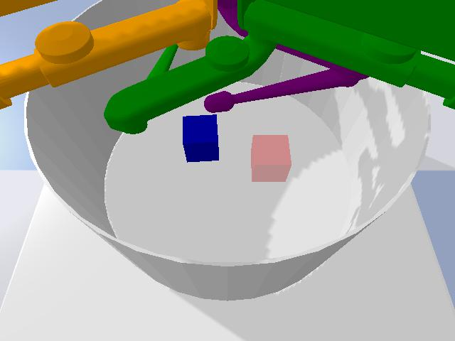

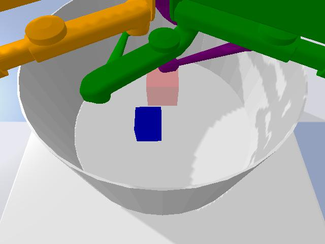

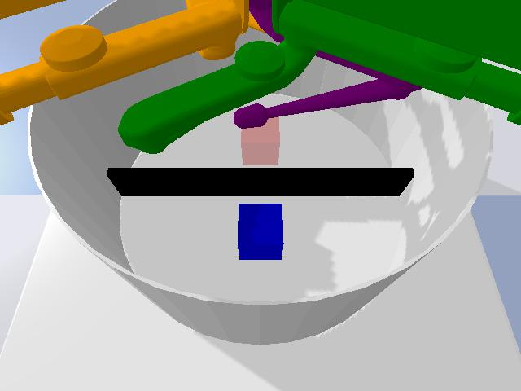

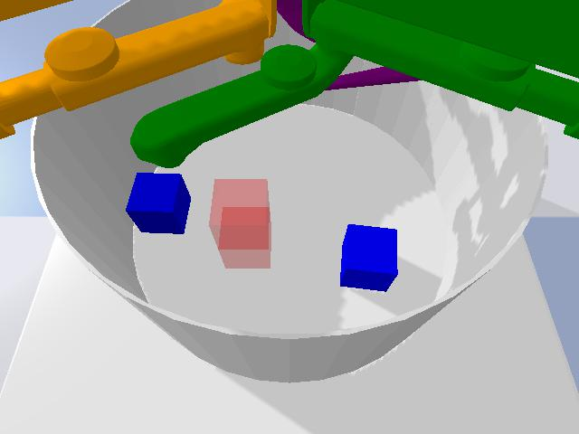

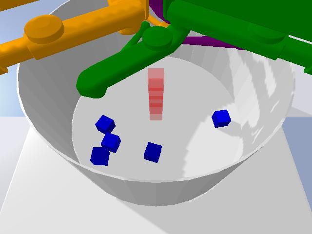

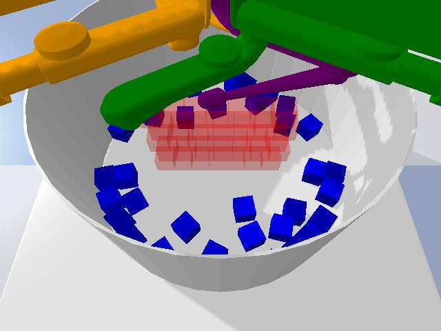

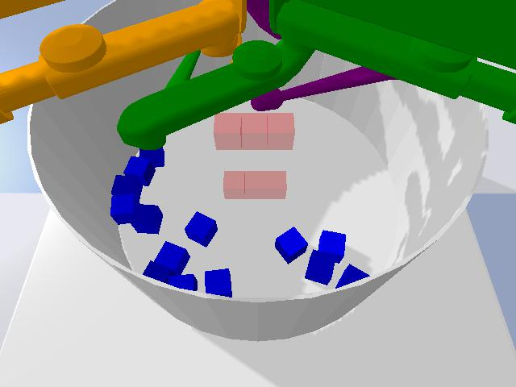

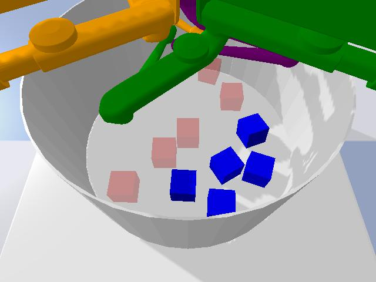

.. |br| raw:: html

    

|br| |br| |br| |br| |br| |br| |br| |br| |br| |br| |br| |br| |br| |br| |br| |br| |br| |br| |br| |br| |br| |br| |br|

CausalWorld comes with 8 task-distributions that range in difficulty from rather simple to extremely challenging.
All tasks follow a common goal formulation: Build a given 3D goal shape (visualizes in opaque color) from
a given set of building blocks.

By default each task-distribution that is passed to the CausalWorld environment
generates a fixed characteristic goal shape of this distribution with fixed initial building block poses.

Each task-generator exposes a complete set of task-defining variables such that one can systematically change or
randomize any aspect of interest during training and evaluation.

Each task-generator comes with a default
structured observations but you can also use the image observations from 3 cameras mounted on the platform
if you don't want to bypass the vision component (including goal images).

Success within a given environment can be measured at any time
step using the fractional volumetric overlap of the tool_blocks with the 3D goal shapes.

.. list-table:: Table of task-generators
   :widths: 25 75
   :header-rows: 1

   * - Task-generator
     - Description
   * - Pushing
     - The goal is to move or push a single cuboid towards a goal pose, which is positioned on the arena floor.
   * - Picking
     - The goal is to pick up a single cuboid and hold it in a certain goal pose in the air above the initial pose.
   * - Pick and Place
     - The goal is to pick up a single cuboid and place it behind a fixed barrier in a given goal pose on the arena floor.
   * - Stacking2
     - The goal is to stack two cuboids above each other given a goal pose.
   * - Towers
     - The goal is to build tower-shaped structures from a set of smaller cuboids under a give goal pose
   * - Stacked Blocks
     - The goal is to build wall-like goal shapes from a set of smaller cuboids under a give goal pose.  The additional difficulty is that the goal poses' stability might be very sensitive to small inaccuracies in the structure
   * - Creative Stacked Blocks
     - The goal is to fill provided goal shapes from a set of smaller cuboids  The additional difficulty is that the goal shape is partial which forces the agent to use some sort of imagination to solve the task.
   * - General
     - The goal is to restore a stable constellation of cuboids in the arena.
   * - Reaching
     - The goal is to reach three different positions in space. Note: This task does not fit into the target shape formulation from all the tasks above but is intended as a starter environment for testing your agent.

------------------
Observation spaces
------------------

There are two default modes of observation spaces: 'pixel' and 'structured'

pixel: Three cameras are mounted around the trifinger robot pointing on the floor. In this mode the observations
after each time step are the three raw rgb images from these cameras showing the actual tool_blocks and fingers.

The goal shape is depicted in three additional rgb images in which the robot fingers are removed from the scene.

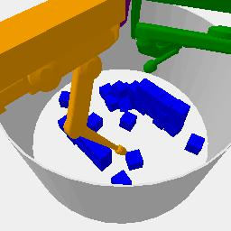

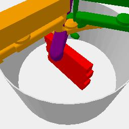

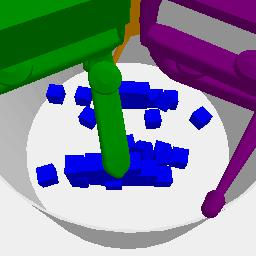

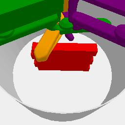

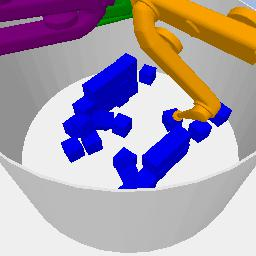

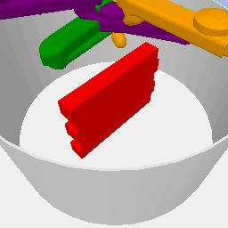

|br| |br| |br| |br| |br| |br| |br| |br| |br| |br| |br| |br| |br| |br| |br| |br| |br| |br| |br| |br| |br| |br| |br| |br| |br| |br| |br| |br| |br| |br| |br| |br| |br| |br| |br| |br| |br|

structured: In this mode the observation space is a lower-dimensional feature vector that is structured in the following order with the number of dimensions in parenthesis:
time left for task (1), joint_positions (9), joint_velocities (9), end_effector_positions (9). Then for each tool object in the
environment additional 17-dimensions are used representing: type (1), size (3), cartesian_position (3),
quaternion_orientation (4), linear_velocity (3), angular_velocity (3). For each goal subshape in the environment additional
11-dimesnions are used representing: type (1), size (3), cartesian_position (3) and orientation (4). Lastly, if there are any fixed blocks in the environment additional
11-dimesnions are used representing: type (1), size (3), cartesian_position (3) and orientation (4).

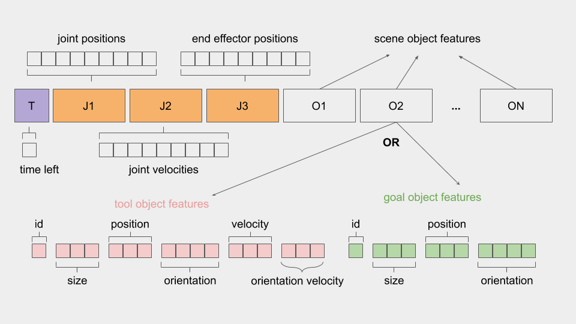

----------------------------------
Rewards and additional information
----------------------------------

By default, the goal of each task-generator in CausalWorld is defined as filling up a target shape's volume as much as the agent could
in the specified time limit with the available tool blocks. Thus we can define a natural success metric at each time step
in terms of the fractional volumetric overlap between all the tools and the goal shape in the stage, whose values range
between 0 (no overlap) and 1 (complete overlap). The magnitude of this term to be added to the reward returned at
each time step can be set by the argument fractional_reward_weight, that is being set to 1 by default.

Additionally, a dense reward can be defined for each task-generator that might provide more signal during training to
solve the task at hand. We provide dense reward terms for the tasks reaching, pushing, picking and pick-and-place.
The contributing weight of each term can be set by reward_weights passed to the task-generator. See the respective
task class definitions for details regarding the proposed rewards.

Finally you can turn off these dense reward signals with the help of the activate_sparse_rewards argument during
initialization of the task which will return a reward of 1 whenever more than 90 percent of the goal shape are filled
and 0 otherwise.

The info dict - by default - contains the keys fractional_success and success defined as above and the keys
desired_goal and achieved_goal that might be relevant when training using Hindsight Experience Replay. Additionally
you can get a nested dictionary of all current state variables via the key ground_truth_current_state_variables as well
as privileged information in the form of possible solution interventions via the key possible_solution_intervention.
For this to be added call the methods add_ground_truth_state_to_info() or expose_potential_partial_solution() respectively.

----------------------
Defining your own task
----------------------

You'd like to have another task-generator with fancy objects or goal shapes? Define your own task just as shown below!

.. literalinclude:: ../../tutorials/defining_task/tutorial_one.py
   :language: python