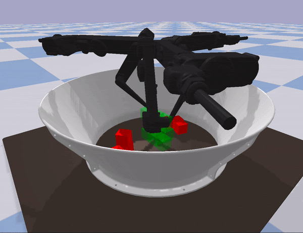
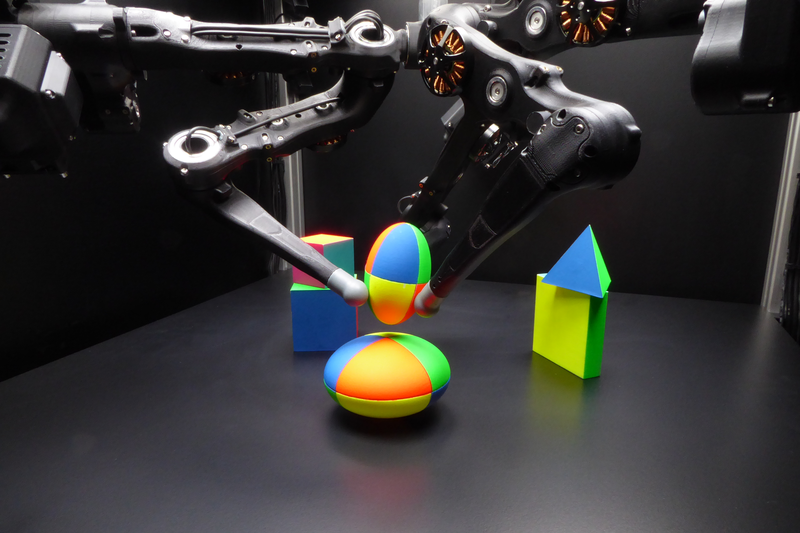

Welcome to Causal World's documentation!
===========================================

.. |br| raw:: html

    

|br| |br| |br| |br| |br| |br| |br| |br| |br| |br|

Reinforcement learning (RL) is an attractive solution for learning controllers
in high dimensional continuous domains. Despite the impressive results so far,
it is a common problem in RL that these agents fail to transfer their learned
skills to different but related environments, such as generalizing to different
goals. Due to the unavailability of benchmarks for explicitly testing
generalization capabilities, it is hard to draw sound conclusions of what the
agent actually learned, and to which degree it understands the meaning of cause
and effect.We propose a novel benchmark, CausalWorld, for causal structure
learning and parametric generalization for RL in a robotic manipulation environment.
Within this benchmark,tasks circle around constructing 3D shape goals from a
given set of available building blocks. The benchmark allows to investigate
the understanding of actions and their effect on the properties of the different
objects themselves, referred to as object affordances, when interacting with
the environment and to systematically test the generalization capabilities
of learned policies

.. code-block:: python

    from causal_world import CausalWorld
    from causal_world import task_generator

    task = task_generator(task_generator_id='stacked_blocks')
    env = CausalWorld(task=task)
    env.reset()
    for _ in range(2000):
        obs, reward, done, info = env.step(env.action_space.sample())
    env.close()

.. toctree::
   :maxdepth: 2
   :caption: Guide

   guide/install.rst
   guide/getting_started.rst
   guide/task_setups.rst
   guide/evaluating_policy.rst

.. toctree::
   :maxdepth: 3
   :caption: Contents

   modules/causal_world.rst

Indices and tables
==================

* :ref:`genindex`
* :ref:`modindex`