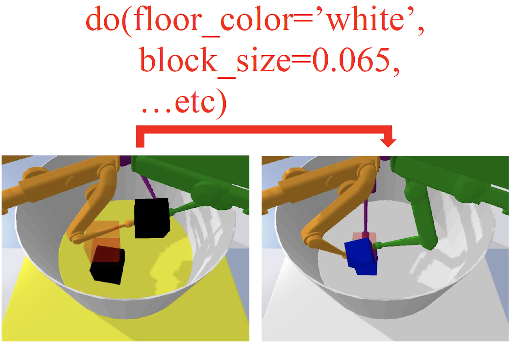

CausalWorld Overview
====================
CausalWorld is an open-source simulation framework and benchmark for causal structure
and transfer learning in a robotic manipulation environment (powered by `bullet <https://github.com/bulletphysics/bullet3>`_) where tasks
range from rather simple to extremely hard. Tasks consist of constructing 3D shapes from a given set of blocks - inspired by
how children learn to build complex structures. The release v1.2 supports many interesting goal shape families as well as exposing many causal and non-causal variables in the environment to perform do_interventions on them.

Checkout the project's `website <https://sites.google.com/view/causal-world/home>`_ for the baseline results and the paper.

.. image:: ./media/random.gif
   :scale: 48 %
   :alt: Random Interventions
   :align: left

.. |br| raw:: html

    

.. image:: ./media/pushing_snap.jpg
   :scale: 30 %
   :alt: Pushing Example
   :align: left

.. image:: ./media/picking_snap.jpg
   :scale: 30 %
   :alt: Picking Example
   :align: left

.. image:: ./media/pick_and_place_snap.jpg
   :scale: 30 %
   :alt: Pick And Place Example
   :align: left

.. image:: ./media/stacking2_snap.jpg
   :scale: 30 %
   :alt: Stacking2 Example
   :align: left

.. image:: ./media/towers_snap.jpg
   :scale: 30 %
   :alt: Towers Example
   :align: left

.. image:: ./media/stacked_blocks_snap.jpg
   :scale: 30 %
   :alt: Stacked Blocks Example
   :align: left

.. image:: ./media/creative_stacked_blocks_snap.jpg
   :scale: 30 %
   :alt: Creative Stacked Blocks Example
   :align: left

.. image:: ./media/general_snap.jpg
   :scale: 30 %
   :alt: Stacking2 Example
   :align: left

.. image:: ./media/question_mark.png
   :scale: 30 %
   :alt: Own Task Example
   :align: left

|br| |br| |br| |br| |br| |br| |br| |br| |br| |br|

|br| |br| |br| |br| |br| |br| |br| |br| |br| |br| |br| |br| |br| |br| |br| |br| |br| |br| |br| |br|

The main advantages of this benchmark can be summarized as below:

- That the environment is a simulation of an open-source robotic platform, hence offering the possibility of sim-to-real transfer (check it out `here <https://sites.google.com/view/trifinger/home-page>`_).
- It provides a combinatorial family of tasks with a common causal structure and underlying factors (including, e.g., robot and object masses, colors, sizes).
- The user (or the agent) may intervene on all causal variables, which allows for fine-grained control over how similar different tasks (or task distributions) are.
- Easily defining training and evaluation distributions of a desired difficulty level, targeting a specific form of generalization  (e.g.,  only  changes  in  appearance  or  object  mass).
- A modular design to create any learning curriculum through a series of interventions at different points in time.
- Defining curricula by interpolating between an initial and a target task.
- Explicitly evaluating and quantifying generalization across the various axes.
- A modular design offering great flexibility to design interesting new task distribution.
- Investigate the understanding of actions and their effect on the properties of the different objects themselves.
- Lots of tutorials provided for the various features offered.

**Lets get to business!**

You can start right away with couple of lines as seen below:

.. code-block:: python

    from causal_world.envs import CausalWorld
    from causal_world.task_generators import generate_task

    task = generate_task(task_generator_id='stacked_blocks')
    env = CausalWorld(task=task)
    env.reset()
    for _ in range(2000):
        obs, reward, done, info = env.step(env.action_space.sample())
    env.close()

.. toctree::
   :maxdepth: 2
   :caption: Guide

   guide/install.rst
   guide/getting_started.rst
   guide/task_setups.rst
   guide/evaluating_policy.rst
   guide/intervention_spaces.rst

.. toctree::
   :maxdepth: 3
   :caption: API

   modules/causal_world.rst

Indices and tables
==================

* :ref:`genindex`
* :ref:`modindex`